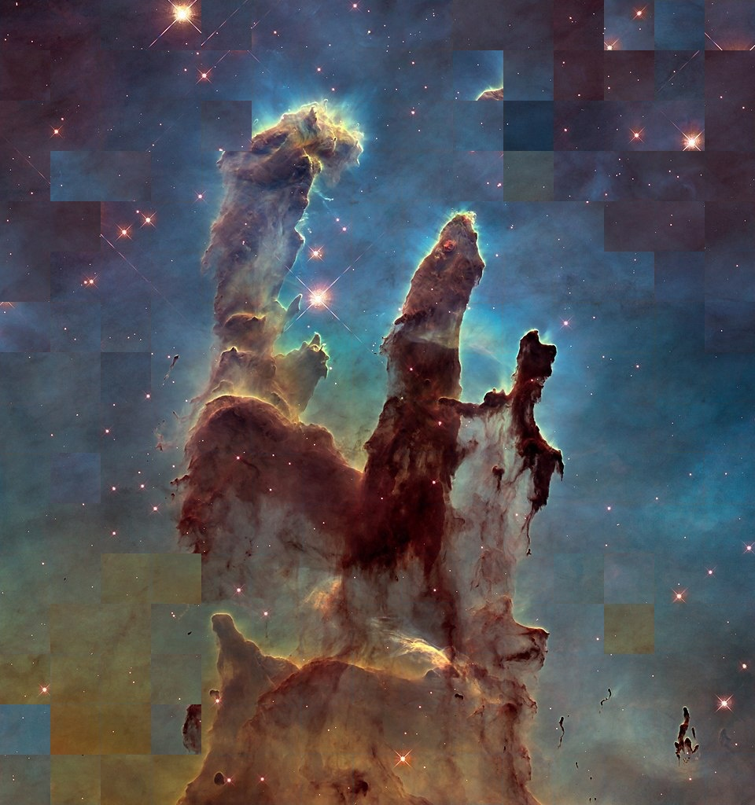

# Puzzle Solver using Genetic Algorithm
## Project: Dip Chick
The task of this project is to create a genetic Algorithm based Puzzle Solver for large number of pixels.

## Link to Github Repository
https://github.com/Digital-Image-Processing-IIITH/dip-project-dip-chick

## Contents
1. Requirements
2. Running the Code
3. Dataset
4. Results
6. Team Members

## Reqirements

Install requirements:

```bash
$ pip install -r requirements.txt
$ sudo apt-get install python-tk
$ sudo pip install pillow
```

## To run the Code!

```python
python3 gui.py
```
This contains all the files combined in the single code and the gui attached with it.

In the GUI, try for 3 levels of puzzles for diffrent level of population and generation.

## Dataset

The dataset used for this project is created by manually downloading the images from Google.

```bash
images
├── input
│   
└── output 
```

This file contains original images and then these are shuffled and given as input to the code base.

- Input: Clean and Origial Images
- Output: Images after getting solved

## Results
The code is giving around 90% accuracy for very large puzzles with the neighbour comparison.

| Input Given     | Result Obtained |
| ----------- | ----------- |
|     |      |

This is with 1000 population.

The code will not give this much accuracy on the images which will have some standard paading or coloring on the sides as it thing that it should be together.

## Team Members
| Name      | Student Id |
| ----------- | ----------- |
| Gunjan Gupta     | 2019111035      |
| Shivaan Sehgal  | 2018111026       |
| Akash Verma   | 2018101011       |
| Vedant Mundheda  | 2018112006       |